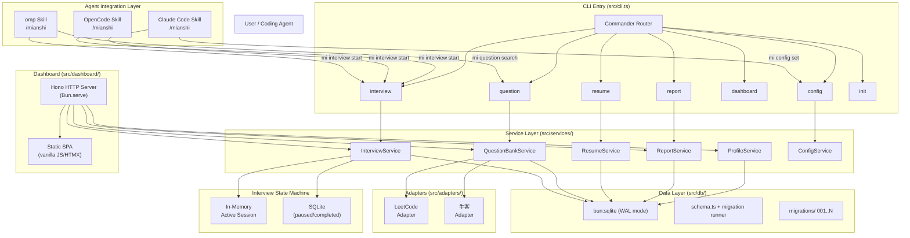
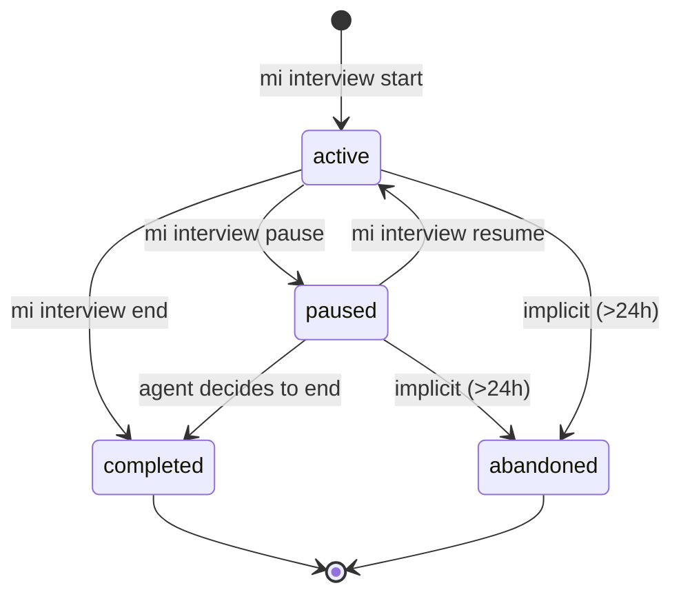
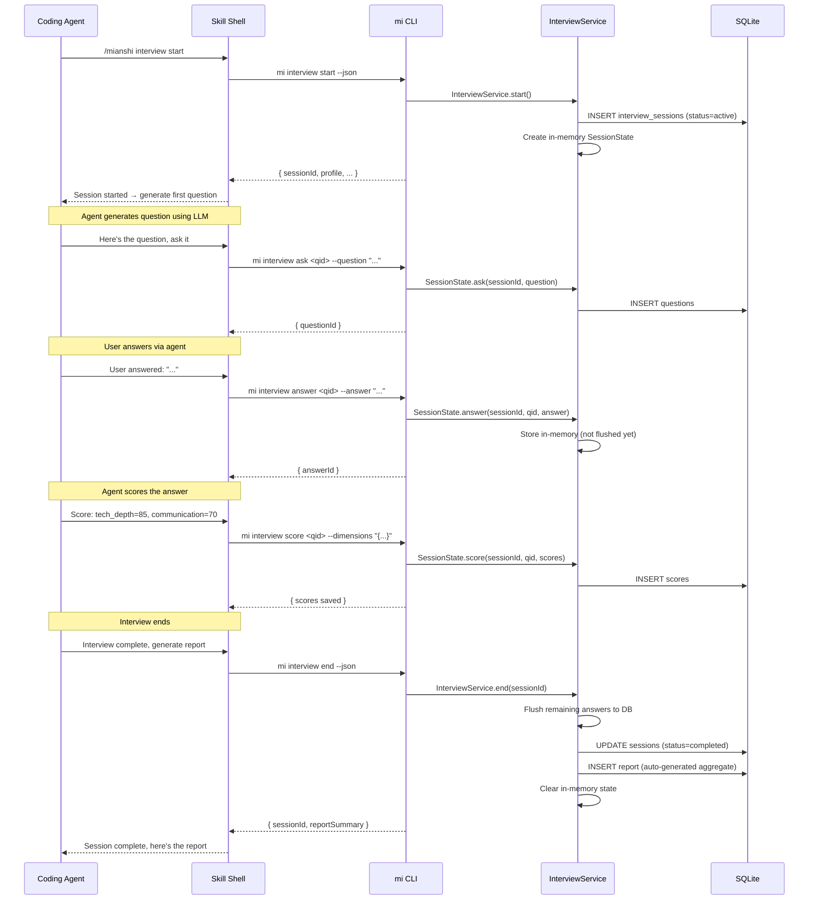

# Architecture Research: mianshiguan

> Research output — recommended architecture with rationale and alternatives.
> Status: researched | Date: 2026-07-11

---

## Recommendation
**Domain-Grouped Monorepo + Commander Tree + bun:sqlite + Typed Error Classes + Single Source Skill Templates + Hono HTTP + In-Memory/DB State** — a layered CLI architecture that separates data from AI, with a thin skill shell for agent integration, and a read-only dashboard SPA. Every component is independently replaceable.

---

## Architecture Overview



---

## Alternatives Evaluated

### 1. Project Structure

| Approach | Strengths | Weaknesses | Verdict |
|----------|-----------|-----------|---------|
| **Flat (single folder)** | Simplest setup, easy initial dev | Unmaintainable at scale; no boundary between layers | ❌ Reject |
| **Domain-Grouped** (recommended) | Clear separation of concerns; each domain is independently testable; mirrors the CLI command structure | Slightly more files to navigate | ✅ **Accept** |
| **Feature Monorepo (turborepo/nx)** | Best for multi-package sharing; independent versioning | Overkill for a single CLI tool; adds build complexity | ❌ Reject |

**Decision**: Use the already-defined domain-grouped structure from coding standards. It exactly matches the CLI command surface (`commands/`, `services/`, `db/`, `dashboard/`, `adapters/`, `skill-templates/`). No monorepo tooling — single `package.json`, single `tsconfig.json`.

---

### 2. CLI Command Registration Pattern

| Approach | Strengths | Weaknesses | Verdict |
|----------|-----------|-----------|---------|
| **Manual `process.argv` routing** | Zero deps; total control | No `--help` auto-generation; error-prone; no subcommand nesting | ❌ Reject |
| **Commander tree** (recommended) | Auto `--help`; subcommand nesting; argument validation; widely known; 2kB gzip | Dependency (but small and stable) | ✅ **Accept** |
| **Yargs** | Feature-rich; Chinese locale support | Larger bundle (17kB gzip); more complex API for simple use cases | ⚖️ Alternative |

**Decision**: Use **Commander** for its simplicity, auto-help generation, and subcommand nesting. The Chinese help text requirement (coding-standards) is easily met with Commander's `.description()` calls. Fallback to Yargs only if we need advanced features like positional argument completion.

```
# Commander tree structure:
mi
  interview
    start [--profile] [--resume] [--jd] [--style]
    status
    pause
    resume
    end
  question
    list [--source] [--tags] [--json]
    search [--source] [--tags] [--difficulty]
    add
    remove <id>
  resume
    import --file <path>
    list
    show <id>
    update <id>
    delete <id>
  report
    list [--profile] [--json]
    show <id> [--json]
    export <id> [--pdf]
  dashboard
  config
    get [key]
    set <key> <value>
    list
  init [--platform] [--dry-run]
```

---

### 3. Database Schema Design — Core Tables

Decision: **bun:sqlite (built-in, no better-sqlite3 wrapper)** per coding standards. WAL mode for concurrent reads. Migrations via `_schema_version` table.

#### Core Tables

| Table | Purpose | Key Columns |
|-------|---------|-------------|
| `profiles` | Multi-profile support | id, name, target_role, target_company, created_at, updated_at |
| `resumes` | Resume storage (one per profile) | id, profile_id (FK), title, content_md, content_pdf_text, version, created_at |
| `interview_sessions` | Interview lifecycle | id, profile_id (FK), status (active/paused/completed/abandoned), interviewer_style, started_at, paused_at, completed_at |
| `interview_phases` | Multi-phase structured interview | id, session_id (FK), phase_order, phase_type, status, started_at |
| `questions` | Questions asked in interviews | id, session_id (FK), phase_id (FK), question_type (open/coding/mcq), content_json, source (ai_generated/local/leetcode/niuke), external_id, created_at |
| `answers` | User answers | id, question_id (FK), session_id (FK), content_text, code_snippet, duration_seconds, created_at |
| `scores` | Multi-dimension scores | id, question_id (FK), session_id (FK), dimension (tech_depth/communication/project/system/matching), score (0-100), reviewer_notes, created_at |
| `question_bank` | Local reusable question storage | id, source (local/leetcode/niuke), external_id, question_type, title, content_json, tags, difficulty, hints, created_at, updated_at |
| `_schema_version` | Migration tracking | version INTEGER (unique), applied_at TEXT |

**SPEC_GAP-3.1**: The spec mentions "scoring dimensions" (技术深度、沟通表达、项目能力、系统思维、匹配度) in FR-12 but does not specify whether these are fixed or configurable. Recommendation: **fixed dimensions in v1, configurable via `mi config set score-dimensions` in v2**. This affects the `scores.dimension` column — use a CHECK constraint in v1.

**SPEC_GAP-3.2**: `question_bank` needs clearer semantics around adapter-originated questions. A question from LeetCode might have metadata (difficulty, tags, acceptance rate) that differs from local questions. Recommendation: use a JSON `metadata` column for adapter-specific fields; keep `title`, `content_json`, `tags`, `difficulty` as the shared schema.

#### Candidate: EAV vs Fixed-Column Scoring

| Approach | Strengths | Weaknesses | Verdict |
|----------|-----------|-----------|---------|
| **Fixed-column (`scores` table with FK + dimension)** (recommended) | Type-safe; indexable per dimension; easy to query radar data | Schema change needed to add dimensions | ✅ **Accept** |
| **EAV (entity-attribute-value)** | No schema changes for new dimensions | Complex queries; no type safety; ORM-hostile | ❌ Reject |
| **JSON blob in `answers`** | Flexible; single row per answer | Cannot index dimension scores; harder to aggregate | ⚖️ Acceptable for small scale |

**Decision**: Fixed-column approach with a `scores` table. Each answer gets one row per dimension (5 rows per question). Query with `GROUP BY` + `AVG(score)` for radar data. Schema change (code migration) adds dimensions — acceptable for a local-first tool.

---

### 4. Error Handling Pattern

| Approach | Strengths | Weaknesses | Verdict |
|----------|-----------|-----------|---------|
| **Result type (`T | MiError`)** | Exhaustive handling; no surprises; functional style | Verbose; every service call needs `if (err)`; TypeScript union friction | ⚖️ Optional for hot paths |
| **Typed Error Classes** (recommended) | Clear stack traces; `instanceof` dispatch; familiar to most devs; matches coding standards | Must document thrown types | ✅ **Accept** |
| **Thrown strings/objects** | Simple | No type info; no stack traces; impossible to handle selectively | ❌ Reject |

**Decision**: Typed error class hierarchy, thrown from services, caught in CLI handlers:

```
MiError (base)
  ├── MiValidationError     — invalid input/args
  ├── MiNotFoundError       — profile/resume/session not found
  ├── MiStateError          — invalid state transition (e.g., pause when not active)
  ├── MiDatabaseError       — SQLite failures (wrapped)
  ├── MiAdapterError        — LeetCode/牛客 fetch failures
  └── MiConfigError         — missing/invalid config
```

**SPEC_GAP-4.1**: The coding-standards say "Services throw typed errors; CLI handlers catch and format." However, the Dashboard HTTP layer also makes service calls. The HTTP layer needs a translation layer: `ServiceError → HTTP 4xx/5xx`. This is not covered in either spec or standards. Recommendation: add an error-to-HTTP middleware in the dashboard layer.

**SPEC_GAP-4.2**: What happens when the database migration fails? The spec says "user-unaware" but doesn't specify recovery. Recommendation: on migration failure, log the error, roll back, and exit with code 2. The user re-runs `mi` after fixing (e.g., disk space, permission).

---

### 5. Skill Template Architecture

| Approach | Strengths | Weaknesses | Verdict |
|----------|-----------|-----------|---------|
| **Separate files per platform** (`omp/skill.md`, `claude-code/skill.md`) | Easy to understand independently; no branching; simple | 3x maintenance of nearly-identical content; drift risk | ❌ Reject |
| **Single source with platform adapters** (recommended) | Single truth; platform diffs in conditional blocks; CLI pinning works once | Need a rendering function per platform | ✅ **Accept** |

**Decision**: One source template per skill type (`interview.md.ejs`, `question.md.ejs`) with `if platform === 'omp'` / `if platform === 'claude-code'` / `if platform === 'opencode'` conditionals. Exported as a TypeScript function `render(platform, config): string` in `src/skill-templates/interview.ts`. `mi init` calls this function for the detected (or specified) platform.

**SPEC_GAP-5.1**: The spec says "首批支持 omp, claude code, opencode" but does not specify the installation mechanism for each. Known differences:
- **omp**: `.omp/skills/` directory
- **Claude Code**: `CLAUDE.md` or `~/.claude/skills/` (depends on version)
- **OpenCode**: `.opencode/` or project-level config

These installation paths should be documented in a config map, not hardcoded in the template renderer.

**SPEC_GAP-5.2**: What is the skill's interface contract? The agent calls mi commands and receives structured output. But what prompt is injected? The skill template should define:
1. The `mi` commands available
2. The interview workflow (question → collect answer → score → next question)
3. The scoring rubric (dimensions, scale)
4. Report generation instructions
5. How to handle pause/resume

These belong in the skill template itself, not the CLI.

---

### 6. Dashboard HTTP Server

| Approach | Strengths | Weaknesses | Verdict |
|----------|-----------|-----------|---------|
| **Bun.serve (raw)** | Zero deps; minimal overhead | No routing; no middleware; manual JSON parsing | ❌ Reject |
| **Hono** (recommended) | 14kB; Bun-native; great routing; middleware (cors, jwt, etc.); familiar API | Small dependency | ✅ **Accept** |
| **Elysia** | Fastest Bun-native; end-to-end type safety | 60kB; newer ecosystem; fewer examples; allergy to non-Bun runtimes | ⚖️ Viable alternative but riskier |

**Decision**: Use **Hono** for the dashboard HTTP server. It's tiny, Bun-native, and provides clean routing, JSON parsing middleware, and error handling. The dashboard is read-only (all mutations go through CLI), so no auth middleware is needed in v1.

**SPEC_GAP-6.1**: What port does the dashboard serve on? Recommendation: default to `3456`, configurable via `mi config set dashboard-port`. The port should be printed to stdout on startup so agents can detect it.

**SPEC_GAP-6.2**: Route design for dashboard API:

| Method | Route | Purpose |
|--------|-------|---------|
| GET | `/api/stats` | Dashboard overview stats |
| GET | `/api/sessions` | Interview history list |
| GET | `/api/sessions/:id` | Single interview detail |
| GET | `/api/sessions/:id/radar` | Radar chart data for one session |
| GET | `/api/profiles` | Profile list |
| GET | `/api/profiles/:id/trends` | Score trends over time (cross-session) |
| GET | `/api/wrong-questions` | Wrong question collection |
| GET | `/api/wrong-questions/heatmap` | Knowledge heatmap data |
| GET | `/api/scores/timeline` | Score timeline for trend line chart |
| GET | `/api/question-bank` | Question bank listing |
| GET | `/api/reports/:id` | Report data |
| GET | `/api/reports/:id/export` | Export report as JSON (PDF generation is CLI-side) |

---

### 7. State Management for Interview Sessions

| Approach | Strengths | Weaknesses | Verdict |
|----------|-----------|-----------|---------|
| **SQLite-only (no in-memory state)** | Simple; always durable | Raw SQL overhead for every user input during session; harder to manage transient state | ❌ Reject |
| **In-memory for active, SQLite for persistence** (recommended) | Fast reads/writes during active interview; durable persistence on pause/complete | Must handle crash recovery (orphaned active session on restart) | ✅ **Accept** |
| **Full in-memory (no DB during session)** | Fastest possible | If agent crashes mid-interview, all state lost | ❌ Reject |

**Decision**: Dual-layer state:
1. **Active session**: held in a `Map<sessionId, SessionState>` object in the InterviewService. State includes current phase, current question index, accumulated answers (uncommitted), and timing.
2. **Persistence flush**: on `interview pause` / `interview end`, flush the active session to SQLite. On `interview resume`, restore from SQLite back into memory.
3. **Crash recovery**: on startup (`mi` or `mi interview status`), check SQLite for `status='paused'` sessions. Return them in the status output for the agent to offer resume.

**SessionState interface**:
```typescript
interface SessionState {
  id: string;
  profileId: string;
  status: 'active' | 'paused' | 'completed' | 'abandoned';
  interviewerStyle: 'strict' | 'coaching' | 'friendly';
  currentPhase: number;
  currentPhaseType: 'behavioral' | 'technical' | 'coding' | 'system-design' | 'closing';
  questions: QuestionState[];
  startedAt: Date;
  elapsedMs: number; // updated on pause
  resume: {
    contextPrompt: string; // agent context to restore
    lastQuestionId: string | null;
  };
}

interface QuestionState {
  id?: string; // null if not yet persisted
  content: QuestionContent;
  status: 'pending' | 'asked' | 'answered' | 'scored';
  answer: string | null;
  scores: Record<string, number> | null; // dimension → score
  startedAt?: Date;
  answeredAt?: Date;
}
```

**SPEC_GAP-7.1**: How does the agent know what context to restore on resume? The spec says "agent checks if there are unfinished interviews" but doesn't detail the context handoff. The `resume.contextPrompt` field should be populated by the agent during `interview pause` with the last N messages of conversation context. On resume, the skill outputs this context for the agent to restore. This is a skill-level contract, not a CLI concern, but needs defining.

**SPEC_GAP-7.2**: What is the timeout for an active session? If the agent crashes mid-interview, the session stays `active` indefinitely. Recommendation: any session `status='active'` with no activity for >24h is implicitly abandoned. `mi interview status` should flag these and offer to clean them up.

---

## State Machine: Interview Session Lifecycle



---

## Data Flow: End-to-End Interview



---

## Migration Strategy

```text
Boot sequence:
1. Open SQLite with PRAGMA journal_mode = WAL
2. PRAGMA foreign_keys = ON
3. CREATE TABLE IF NOT EXISTS _schema_version (version INTEGER, applied_at TEXT)
4. Read max version from _schema_version
5. Apply pending migration files (sorted) from src/db/migrations/
6. After each migration, INSERT INTO _schema_version
7. If migration fails → log error, rollback, exit code 2
```

Migration file naming: `{NNNN}_description.sql` (e.g., `0001_initial.sql`)

---

## Risk & Mitigations

| Risk | Likelihood | Impact | Mitigation |
|------|-----------|--------|------------|
| **SQLite WAL + concurrent reads** (dashboard + CLI) | Medium | Low | WAL mode allows concurrent readers; single writer via CLI serialization |
| **Crash mid-interview state loss** | Medium | High | In-memory state + periodic flushes to SQLite (per question). On startup, detect orphaned `active` sessions. |
| **LeetCode adapter breakage** (API changes) | High | Medium | Adapter interface with clear error types; cached results expire with TTL; user is warned and falls back to AI-generated questions |
| **Skill template drift across 3 platforms** | Medium | Medium | Single source + conditional blocks + `mi init` version pinning. CI checks that all 3 platforms render. |
| **Dashboard SPA becomes too complex for vanilla JS** | Medium | Low | Start with vanilla + fetch; if complexity grows, migrate to Preact or Alpine.js — no build step needed. |
| **Large question bank loaded from LeetCode** | Low | Low | Pagination in adapter; SQLite handles millions of rows fine. Index on `(source, tags)`. |

---

## SPEC_GAP Items

| ID | Gap | Impact | Recommended Resolution |
|----|-----|--------|----------------------|
| **3.1** | Fixed vs configurable scoring dimensions not specified | Schema design for `scores.dimension` | Fixed in v1 with CHECK constraint; configurable in v2 |
| **3.2** | `question_bank` metadata for adapter-originated questions | Schema design clarity | Add JSON `metadata` column for adapter-specific fields |
| **4.1** | Error handling in Dashboard HTTP layer unspecified | HTTP layer may expose raw error types | Add error-to-HTTP middleware translating MiError → 4xx/5xx |
| **4.2** | Migration failure recovery unspecified | User could be left in broken state | Exit code 2 on migration failure; user re-runs after fixing cause |
| **5.1** | Platform installation paths undocumented | `mi init` needs exact target directories | Document install paths per platform in config map |
| **5.2** | Skill template content undefined (what goes in the prompt) | Agent behavior depends on template quality | Define skill template sections: available commands, workflow, scoring rubric, report format, pause/resume contract |
| **6.1** | Dashboard default port unspecified | Users have no default URL to open | Default to port 3456, configurable via `mi config set dashboard-port` |
| **6.2** | Dashboard API route design not defined | No contract for SPA developer | Define in coding-standards or separate API spec |
| **7.1** | Resume context handoff mechanism not defined | Agent won't know what to restore | Define `resume.contextPrompt` as agent-provided context snapshot on pause |
| **7.2** | Orphaned active session timeout not specified | Sessions can stay active forever | Implicit abandon after 24h inactivity; `mi interview status` reports and offers cleanup |

---

## Key Architectural Decisions Summary

1. **Domain-grouped structure** matching CLI command surface — maintainable, testable, no over-engineering
2. **Commander** for CLI routing — auto-help, subcommands, negligible bundle cost
3. **bun:sqlite with WAL** — fast, concurrent, built-in migration runner
4. **Fixed-column scoring** — query-friendly radar chart data without EAV headaches
5. **Typed error class hierarchy** — catchable, domain-specific, readable stack traces
6. **Single source + conditional skill templates** — one truth, platform differences as conditions
7. **Hono for HTTP** — minimal, Bun-native, good middleware story
8. **Dual-layer interview state** — fast in-memory active sessions, durable SQLite persistence
9. **No LLM calls in CLI** — CLI is pure data layer; all AI happens in the agent
10. **Dashboard is read-only** — all mutations through CLI; HTTP is query-only

---

## Related Documents

- [Requirements](/Users/mutou/vault/projects/mianshiguan/bp/requirements.md)
- [Coding Standards](/Users/mutou/vault/projects/mianshiguan/bp/conventions/coding-standards.md)
- [Design Direction](/Users/mutou/vault/projects/mianshiguan/bp/design/design.md)
- [Core Spec](/Users/mutou/vault/projects/mianshiguan/bp/specs/core/spec.md)
